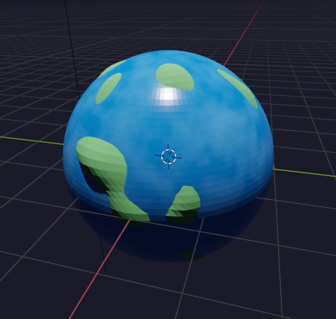

# Centerfuge

Basically a centerfuge is a big spinning cylindrical vortex in the center of your home that rotates and sorts and distributes materials to build and repair your home, as well as clothing and food, as it hyperbolates waste.

Hyperbolation is the process of labeling and wrapping materials in layered yarn-balls (also known as gnotobiotic hyperballs or cognets). 

## Tetraorthodrome

<div style="display: flex; flex-wrap: wrap; gap: 10px;">
  <div style="flex: 1 1 45%;">
    
  </div>
  <div style="flex: 1 1 45%;">
    
  </div>
  <div style="flex: 1 1 45%;">
    
  </div>
  <div style="flex: 1 1 45%;">
    
  </div>
</div>

## Small World Generator



```python
import bpy
import bmesh
import random
import math
from mathutils import Vector, noise

# Clear existing objects
bpy.ops.object.select_all(action='SELECT')
bpy.ops.object.delete()

def create_outer_sphere():
    # Create smooth outer sphere (ocean)
    bpy.ops.mesh.primitive_uv_sphere_add(radius=2.0, location=(0, 0, 0))
    outer_sphere = bpy.context.active_object
    outer_sphere.name = 'OuterSphere'

    # Add subdivision surface modifier
    subsurf = outer_sphere.modifiers.new(name="Subsurf", type='SUBSURF')
    subsurf.levels = 2

    # Create ocean blue material
    blue_mat = bpy.data.materials.new(name="OceanMaterial")
    blue_mat.use_nodes = True
    nodes = blue_mat.node_tree.nodes
    nodes["Principled BSDF"].inputs["Base Color"].default_value = (0.0, 0.3, 0.8, 1)
    nodes["Principled BSDF"].inputs["Roughness"].default_value = 0.2
    nodes["Principled BSDF"].inputs["Specular"].default_value = 0.8

    # Add subtle wave texture
    wave_tex = nodes.new('ShaderNodeTexNoise')
    wave_tex.inputs["Scale"].default_value = 8.0
    wave_tex.inputs["Detail"].default_value = 6.0

    # Add color ramp for water variation
    color_ramp = nodes.new('ShaderNodeValToRGB')
    color_ramp.color_ramp.elements[0].position = 0.4
    color_ramp.color_ramp.elements[0].color = (0.0, 0.2, 0.7, 1)
    color_ramp.color_ramp.elements[1].color = (0.1, 0.4, 0.9, 1)

    blue_mat.node_tree.links.new(wave_tex.outputs["Fac"], color_ramp.inputs["Fac"])
    blue_mat.node_tree.links.new(color_ramp.outputs["Color"], nodes["Principled BSDF"].inputs["Base Color"])

    outer_sphere.data.materials.append(blue_mat)
    return outer_sphere

def create_inner_sphere():
    # Create inner crumpled sphere (land)
    bpy.ops.mesh.primitive_uv_sphere_add(radius=1.8, location=(0, 0, 0))
    inner_sphere = bpy.context.active_object
    inner_sphere.name = 'InnerSphere'

    # Create bmesh for detailed manipulation
    bm = bmesh.new()
    bm.from_mesh(inner_sphere.data)

    # Generate random seed for unique crumpling pattern
    random_seed = random.randint(0, 1000)

    # Add randomized noise displacement to vertices
    for v in bm.verts:
        # Generate noise based on vertex position and random seed
        noise_val = noise.noise(v.co * 2.0 + Vector((random_seed, random_seed, random_seed)))
        # Add secondary noise layer for more variation
        noise_val2 = noise.noise(v.co * 4.0 + Vector((-random_seed, random_seed, -random_seed))) * 0.5
        displacement = (noise_val + noise_val2) * 0.4
        v.co += v.normal * displacement

    # Update mesh
    bm.to_mesh(inner_sphere.data)
    bm.free()

    # Add subdivision surface modifier
    subsurf = inner_sphere.modifiers.new(name="Subsurf", type='SUBSURF')
    subsurf.levels = 2

    # Add displacement modifier for additional detail
    displace = inner_sphere.modifiers.new(name="Displace", type='DISPLACE')
    displace.strength = 0.2

    # Create terrain material
    terrain_mat = bpy.data.materials.new(name="TerrainMaterial")
    terrain_mat.use_nodes = True
    nodes = terrain_mat.node_tree.nodes
    links = terrain_mat.node_tree.links

    # Create more complex terrain texture
    noise1 = nodes.new('ShaderNodeTexNoise')
    noise1.inputs["Scale"].default_value = 5.0
    noise1.inputs["Detail"].default_value = 8.0
    noise1.inputs["W"].default_value = random_seed * 0.1  # Use random seed for variation

    noise2 = nodes.new('ShaderNodeTexNoise')
    noise2.inputs["Scale"].default_value = 10.0
    noise2.inputs["Detail"].default_value = 4.0
    noise2.inputs["W"].default_value = -random_seed * 0.1  # Different variation

    # Mix noises
    mix = nodes.new('ShaderNodeMixRGB')
    mix.blend_type = 'MULTIPLY'
    mix.inputs["Fac"].default_value = 0.5

    # Create color ramp for terrain variation
    color_ramp = nodes.new('ShaderNodeValToRGB')
    color_ramp.color_ramp.elements[0].position = 0.3
    color_ramp.color_ramp.elements[0].color = (0.1, 0.4, 0.1, 1)  # Dark green
    color_ramp.color_ramp.elements[1].position = 0.7
    color_ramp.color_ramp.elements[1].color = (0.2, 0.6, 0.2, 1)  # Light green

    # Add some brown/mountain variations
    mountain_ramp = nodes.new('ShaderNodeValToRGB')
    mountain_ramp.color_ramp.elements[0].position = 0.6
    mountain_ramp.color_ramp.elements[0].color = (0.2, 0.6, 0.2, 1)  # Green
    mountain_ramp.color_ramp.elements[1].color = (0.4, 0.3, 0.2, 1)  # Brown

    # Connect nodes
    links.new(noise1.outputs["Fac"], mix.inputs[1])
    links.new(noise2.outputs["Fac"], mix.inputs[2])
    links.new(mix.outputs["Color"], color_ramp.inputs["Fac"])
    links.new(mix.outputs["Color"], mountain_ramp.inputs["Fac"])

    # Mix terrain colors
    mix_terrain = nodes.new('ShaderNodeMixRGB')
    mix_terrain.inputs["Fac"].default_value = 0.5

    links.new(color_ramp.outputs["Color"], mix_terrain.inputs[1])
    links.new(mountain_ramp.outputs["Color"], mix_terrain.inputs[2])
    links.new(mix_terrain.outputs["Color"], nodes["Principled BSDF"].inputs["Base Color"])

    # Add roughness variation
    nodes["Principled BSDF"].inputs["Roughness"].default_value = 0.8

    inner_sphere.data.materials.append(terrain_mat)
    return inner_sphere

def setup_scene():
    # Create camera
    bpy.ops.object.camera_add(location=(6, -6, 4))
    camera = bpy.context.active_object
    camera.rotation_euler = (math.radians(60), 0, math.radians(45))

    # Create key light (sun)
    bpy.ops.object.light_add(type='SUN', location=(5, 5, 10))
    sun = bpy.context.active_object
    sun.data.energy = 5.0

    # Add fill light for better details
    bpy.ops.object.light_add(type='AREA', location=(-4, -4, 2))
    fill = bpy.context.active_object
    fill.data.energy = 2.0

    # Set up world background
    world = bpy.context.scene.world
    if not world:
        world = bpy.data.worlds.new("World")
        bpy.context.scene.world = world
    world.use_nodes = True
    world.node_tree.nodes["Background"].inputs["Color"].default_value = (0.01, 0.01, 0.02, 1)

# Create the scene
outer_sphere = create_outer_sphere()
inner_sphere = create_inner_sphere()
setup_scene()

# Set render engine to Cycles for better quality
bpy.context.scene.render.engine = 'CYCLES'
bpy.context.scene.cycles.samples = 128

# Set active camera
bpy.context.scene.camera = bpy.data.objects["Camera"]
```

This page is live [here](https://standardgalactic.github.io/Centerfuge/)
